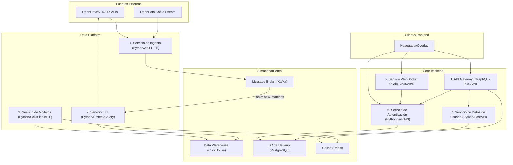

### **Plan de Desarrollo de Backend: Dota 2 Counter-Picker v2.0**

Este documento detalla la estrategia de arquitectura y desarrollo para todos los componentes del lado del servidor. El objetivo es crear un sistema desacoplado, resiliente y de alto rendimiento.

#### **1. Filosofía Arquitectónica y Principios Fundamentales**

El backend se diseñará siguiendo una **arquitectura de microservicios orientada a eventos**. Esta decisión se basa en los siguientes principios:

*   **Responsabilidad Única (Single Responsibility):** Cada microservicio tendrá un propósito de negocio claro y acotado (ej: autenticación, ingesta de datos, sugerencias en tiempo real).
*   **Desacoplamiento (Loose Coupling):** Los servicios se comunicarán a través de APIs bien definidas y colas de mensajes (Kafka), no a través de bases de datos compartidas. Esto permite que cada servicio evolucione y se escale de forma independiente.
*   **Resiliencia (Resilience):** Un fallo en un servicio no crítico (ej: el servicio de cálculo de modelos) no debe provocar la caída de todo el sistema. El API principal seguirá funcionando, quizás con datos cacheados.
*   **Observabilidad (Observability):** Desde el primer día, se integrará el logging, métricas y tracing distribuido para entender el comportamiento del sistema en producción.

#### **2. Stack Tecnológico Principal (Python-first)**

Python es una elección excelente por su robusto ecosistema para ciencia de datos, ML y desarrollo web rápido. Es la tecnología principal, pero se usará la herramienta adecuada para cada trabajo.

*   **Lenguaje Principal:** **Python 3.12+**.
*   **Framework para APIs:** **FastAPI**. Es la elección moderna por su alto rendimiento (basado en Starlette y Pydantic), su generación automática de documentación interactiva (Swagger UI) y su sistema de inyección de dependencias, que facilita las pruebas.
*   **Comunicaciones Asíncronas:** **Celery** (con RabbitMQ o Redis como broker) para la ejecución de tareas en segundo plano que no requieren la latencia ultra baja de un stream processor.
*   **Orquestación de Flujos de Datos:** **Prefect** o **Dagster**. Estas herramientas modernas de orquestación de datos son superiores a Cron. Permiten definir pipelines de datos complejos como código Python, con observabilidad, reintentos y gestión de dependencias.
*   **Persistencia de Datos:**
    *   **Base de Datos Analítica (OLAP):** **ClickHouse**.
    *   **Base de Datos Relacional (OLTP):** **PostgreSQL**.
    *   **Caché en Memoria:** **Redis**.
    *   **Cola de Mensajes / Event Streaming:** **Apache Kafka**.

#### **3. Descomposición de Microservicios**

El backend se dividirá en los siguientes servicios independientes, cada uno en su propio contenedor Docker.

##### **Diagrama de Flujo del Backend**

---

##### **Detalle de Cada Microservicio:**

**1. Servicio de Ingesta (`ingestion-service`)**
*   **Responsabilidad:** Capturar IDs de partidas del stream de OpenDota en tiempo real y publicarlos en un tópico de Kafka. Su única función es ser un puente rápido y resiliente.
*   **Tecnología:** Python con `AIOHTTP` y `aiokafka`. Se elige `AIOHTTP` por su madurez y rendimiento para operaciones de red intensivas.
*   **Flujo:** `Listen(OpenDota Stream) -> Publish(Kafka Topic: "match_ids_raw")`.

**2. Servicio de ETL (`etl-service`)**
*   **Responsabilidad:** Consumir los IDs de partidas desde Kafka, enriquecerlos con datos completos de las APIs externas, transformar los datos a un formato limpio y estructurado, y cargarlos en ClickHouse.
*   **Tecnología:** Python con `Faust` o un consumidor de Kafka customizado. Se ejecutarán tareas de procesamiento en paralelo usando **Celery** para no bloquear al consumidor principal.
*   **Flujo:** `Consume(Kafka: "match_ids_raw") -> Call(API OpenDota) -> Transform(Data) -> Load(ClickHouse)`.

**3. Servicio de Cálculo de Modelos (`model-service`)**
*   **Responsabilidad:** Ejecutar periódicamente los cálculos estadísticos y de ML. Esto incluye el `Advantage` básico, la `Sinergia`, y el `Personal Advantage Score (PAS)`.
*   **Tecnología:** Python. La lógica del pipeline se definirá con **Prefect/Dagster**. Los cálculos usarán `Polars` o `DuckDB` (para manipulaciones en memoria ultrarrápidas) y `Scikit-learn` o `TensorFlow` para los modelos.
*   **Flujo:** `Prefect/Dagster Trigger -> Query(ClickHouse) -> Calculate Models -> Write(Redis Cache)`. Los resultados se escriben en Redis con una estructura clave-valor eficiente (ej: `counters:patch_7.36:skill_high:hero_1`).

**4. API Gateway (`api-gateway`)**
*   **Responsabilidad:** Punto de entrada único para todas las peticiones del cliente. Expone una API **GraphQL**. Se encarga de la agregación de datos (federación), el enrutamiento a otros servicios y la validación de JWTs.
*   **Tecnología:** **FastAPI** con la librería Graphene o Strawberry para GraphQL.
*   **Flujo:** `Request(GraphQL Query) -> Validate(JWT with AuthService) -> Fetch(Data from Redis/UserService) -> Aggregate -> Response`.

**5. Servicio de Draft en Tiempo Real (`websocket-service`)**
*   **Responsabilidad:** Gestionar las conexiones persistentes vía WebSocket para la comunicación de baja latencia durante el draft.
*   **Tecnología:** **FastAPI** tiene soporte nativo para WebSockets, lo que lo hace una elección coherente y de alto rendimiento.
*   **Flujo:** `Client(Connect WS) -> Subscribe("draft:{match_id}") -> Client(Send Pick) -> Service(Broadcast to Channel)`.

**6. Servicio de Autenticación (`auth-service`)**
*   **Responsabilidad:** Gestionar el registro y login de usuarios a través del OpenID de Steam (flujo OAuth 2.0 PKCE). Emite, refresca y valida los JWT.
*   **Tecnología:** **FastAPI**. Usará librerías de seguridad como `python-jose` para la gestión de JWTs.
*   **Flujo:** `Client(Login with Steam) -> Steam(Redirect to Callback) -> Service(Validate, Create User in PG, Generate JWT) -> Client`.

**7. Servicio de Datos de Usuario (`user-service`)**
*   **Responsabilidad:** Gestionar los datos de perfil del usuario (suscripción, preferencias, etc.) que se almacenan en la base de datos relacional.
*   **Tecnología:** **FastAPI**. CRUD clásico sobre la base de datos PostgreSQL.
*   **Flujo:** `API Gateway -> Request(user_profile) -> UserService -> Query(PostgreSQL) -> Response`.

#### **4. Estrategias de Buenas Prácticas y Low-Code**

No se usará "Low-Code" para construir el núcleo de los servicios, ya que esto limitaría el rendimiento y la personalización. En su lugar, se aplicarán principios de desarrollo rápido y se usarán herramientas Low-Code de forma estratégica:

*   **Generación automática de APIs:** La mayor ventaja "Low-Code" será la que nos brinda **FastAPI**: a partir de los modelos de datos de Pydantic, genera la validación de datos y la documentación OpenAPI de forma automática, acelerando drásticamente el desarrollo y las pruebas de las APIs.
*   **Orquestación de Flujos de Datos Visual:** Herramientas como **Prefect** o **Dagster** tienen UIs que permiten visualizar y gestionar los flujos de datos complejos (nuestro pipeline de ETL y cálculo de modelos) sin necesidad de escribir código para el dashboarding, facilitando el monitoreo a personal no-técnico.
*   **Paneles de Administración y Operaciones (Low-Code):** En lugar de desarrollar un panel de administración interno desde cero para gestionar usuarios, ver estadísticas o lanzar tareas manualmente, se utilizará una plataforma como **Retool** o **Appsmith**. Estas herramientas se conectan de forma segura a nuestras bases de datos (PostgreSQL, ClickHouse) y APIs REST internas, permitiendo construir herramientas operativas robustas en horas en lugar de semanas.

Este enfoque mixto nos da la velocidad del Low-Code para tareas de soporte y la potencia del código a medida para el producto principal.