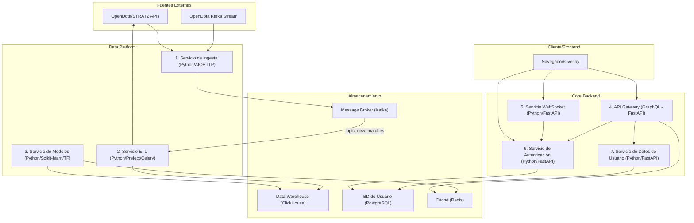

# Diagrama de Backend Corregido

```mermaid
flowchart TD
    subgraph "Fuentes Externas"
        DotaAPIs["OpenDota/STRATZ APIs"]
        KafkaStream["OpenDota Kafka Stream"]
    end

    subgraph "Data Platform"
        IngestionService["1. Servicio de Ingesta (Python/AIOHTTP)"]
        ETLService["2. Servicio ETL (Python/Prefect/Celery)"]
        ModelService["3. Servicio de Modelos (Python/Scikit-learn/TF)"]
    end
    
    subgraph "Core Backend"
        APIGateway["4. API Gateway (GraphQL - FastAPI)"]
        WebSocketService["5. Servicio WebSocket (Python/FastAPI)"]
        AuthService["6. Servicio de Autenticación (Python/FastAPI)"]
        UserService["7. Servicio de Datos de Usuario (Python/FastAPI)"]
    end

    subgraph "Almacenamiento"
        Kafka["Message Broker (Kafka)"]
        ClickHouse["Data Warehouse (ClickHouse)"]
        Postgres["BD de Usuario (PostgreSQL)"]
        Redis["Caché (Redis)"]
    end

    subgraph "Cliente/Frontend"
        Browser["Navegador/Overlay"]
    end

    %% Flujos de Datos principales
    KafkaStream --> IngestionService
    DotaAPIs --> IngestionService
    IngestionService --> Kafka
    Kafka -->|"topic: new_matches"| ETLService
    ETLService --> DotaAPIs
    ETLService --> ClickHouse
    
    %% Flujos de Modelos
    ModelService --> ClickHouse
    ModelService --> Redis

    %% Flujos de API y almacenamiento
    APIGateway --> Redis
    APIGateway --> UserService
    APIGateway --> AuthService
    UserService --> Postgres
    AuthService --> Postgres
    WebSocketService --> AuthService

    %% Exposición externa
    Browser --> APIGateway
    Browser --> WebSocketService
    Browser --> AuthService
```
