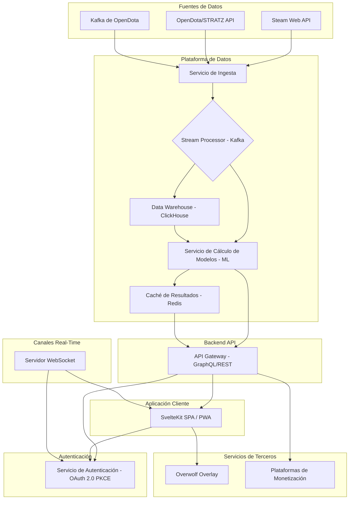
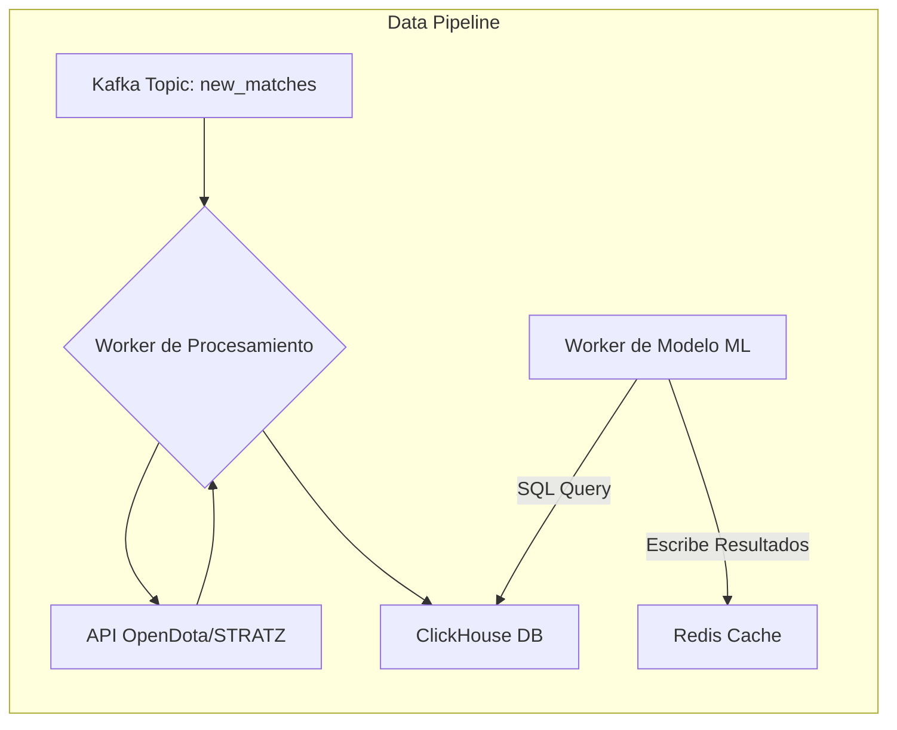

¡Excelente análisis! Has realizado una ingeniería inversa muy detallada de `dotapicker.com/counterpick`. Ahora, como ingeniero de software senior, te presento un plan completo y estructurado para construir una versión moderna, escalable y funcional de esta herramienta, utilizando las mejores prácticas y tecnologías actuales.

### **Informe de Diseño de Sistema: Dota 2 Counter-Picker v2.0 (2025)**

---

### 1. Entendiendo el Producto: Análisis de `dotapicker.com/counterpick`

**¿Qué es?**
`dotapicker.com/counterpick` es una aplicación web de página única (SPA) diseñada para ayudar a los jugadores de Dota 2 durante la fase de selección de héroes (*draft*). Su función principal es sugerir, en tiempo real, qué héroes tienen la mayor "Ventaja" estadística contra los héroes seleccionados por el equipo enemigo.

**¿Cómo funciona?**
1.  **Carga de Datos:** Al iniciar, la aplicación carga en el navegador del cliente un único archivo JSON de gran tamaño (~600kB) que contiene una matriz de "Ventaja" precalculada para cada enfrentamiento de héroe contra héroe.
2.  **Cálculo en el Cliente:** Cuando el usuario selecciona los héroes enemigos, la lógica de la aplicación (que se ejecuta completamente en el navegador) filtra y calcula la puntuación agregada de los posibles héroes "counter".
3.  **Fuente de Datos:** Los datos se calculan a partir de millones de partidas públicas obtenidas a través de la API web de Steam y, posiblemente, de servicios de terceros como OpenDota.
4.  **Funcionalidad Premium:** Ofrece un sistema "Personal Advantage Scores" (PAS) que ajusta las recomendaciones según el historial de partidas del usuario, una vez que este se autentica vía Steam.

---

### 2. Visión Arquitectónica para una Solución Moderna (2025)

El diseño propuesto se basa en una **arquitectura de microservicios** desacoplada, orientada a eventos y optimizada para el tiempo real, la escalabilidad y la observabilidad. Rompemos el monolito cliente-servidor para optimizar cada parte del proceso.

A continuación, el diagrama de alto nivel:

---

### 3. Diseño Detallado por Componente

#### **3.1. Plataforma de Datos: La Base Analítica**

El corazón de la aplicación es su capacidad para procesar datos a gran escala y ofrecer estadísticas precisas.

*   **Ingesta de Datos (Data Ingestion):**
    *   **Tecnología:** Un servicio escrito en Go o Rust, optimizado para concurrencia.
    *   **Funcionamiento:** En lugar de descargas masivas periódicas, se conectará al stream de Kafka de OpenDota, que publica IDs de partidas a medida que se completan. Para datos históricos o complementarios, usará las API REST de OpenDota y STRATZ.
    *   **Flujo:** `(OpenDota Stream) -> Servicio de Ingesta -> Tópico de Kafka "new_matches"`

*   **Procesamiento y Almacenamiento (ETL y Data Warehouse):**
    *   **Tecnologías:**
        *   **Broker de Mensajes:** **Apache Kafka**. Es el estándar de facto para procesar flujos de eventos en tiempo real y desacoplar servicios.
        *   **Base de Datos Analítica (OLAP):** **ClickHouse**. Es una base de datos columnar ultra-rápida, ideal para consultas analíticas complejas sobre volúmenes masivos de datos, como los de las partidas de Dota. Supera a bases de datos tradicionales en rendimiento para este caso de uso.
    *   **Funcionamiento:**
        1.  Un consumidor de Kafka procesa los nuevos IDs de partida del tópico `new_matches`.
        2.  Por cada ID, obtiene los detalles completos de la partida desde la API correspondiente.
        3.  Transforma los datos crudos y los inserta en tablas optimizadas en ClickHouse (e.g., `matches`, `player_performance`, `matchups`).

*   **Modelo Estadístico y Machine Learning (ML):**
    *   **Tecnologías:** Un servicio en Python con librerías como TensorFlow, PyTorch y Scikit-learn.
    *   **Funcionamiento:**
        *   **Cálculo de "Advantage":** Se ejecutan trabajos programados (p. ej. cada hora) que consultan ClickHouse para recalcular la métrica de "Advantage" con datos frescos. El modelo podría refinarse con suavizado bayesiano para dar más peso a datos recientes.
        *   **Nuevos Modelos:** Introducimos modelos de ML para calcular:
            *   **Sinergia de equipo:** ¿Qué tan bien funcionan ciertos héroes juntos?
            *   **Predicción de rol:** Basado en el borrador inicial, ¿cuál es el rol más probable para cada héroe?
            *   **Análisis Personal (PAS):** Un modelo que aprenda de las métricas de rendimiento de un usuario (GPM, XPM, KDA por héroe) para predecir su éxito personal en un enfrentamiento.
        *   **Cacheo:** Los resultados de estos cálculos (la matriz de Ventaja y Sinergia) se almacenan en una caché de alta velocidad como **Redis** para un acceso casi instantáneo desde la API.

#### **3.2. Backend: API y Servicios en Tiempo Real**

*   **API Gateway:**
    *   **Tecnología:** **GraphQL** con una biblioteca como Apollo Server (sobre Node.js) o Absinthe (Elixir).
    *   **Diseño:** Un único endpoint GraphQL para las lecturas. Esto permite al cliente solicitar exactamente los datos que necesita (por ejemplo, "dame los 5 mejores counters para X e Y, con sus tasas de victoria y mi rendimiento personal"), evitando el sobre-envío de datos (over-fetching) del JSON monolítico. Para escrituras (como la configuración del usuario), se usarán mutaciones de GraphQL o endpoints REST específicos.
    *   **Seguridad:** Toda la comunicación será sobre **HTTPS**. La autorización se gestionará con JSON Web Tokens (JWT).

*   **Servicio de Draft en Tiempo Real:**
    *   **Tecnología:** **WebSockets**. Un servidor de WebSocket dedicado (escrito en Node.js, Elixir o Go) gestionará las conexiones en vivo.
    *   **Funcionamiento:**
        1.  Cuando el cliente (navegador o overlay) inicia un draft, se conecta al servidor WebSocket y se suscribe a un canal único (ej. `draft:{matchID}`).
        2.  Cualquier cambio en el draft (un pick o ban nuevo) detectado por el cliente o un overlay se envía por el WebSocket.
        3.  El servidor recibe el evento, lo valida y lo retransmite a todos los clientes suscritos a ese canal, garantizando que todos vean el mismo estado del draft con una latencia mínima (<100ms).

*   **Autenticación:**
    *   **Tecnología:** Un servicio de autenticación dedicado que implementa **OAuth 2.0 con el flujo PKCE**, integrándose con el OpenID de Steam. Esto es mucho más seguro que el manejo de tokens de API manuales y en texto claro.

#### **3.3. Frontend: Experiencia de Usuario Moderna**

*   **Framework:** **SvelteKit**. Es conocido por generar paquetes de JavaScript muy pequeños y rápidos, resultando en tiempos de carga e interacción inferiores a frameworks como React (usado por Next.js). Para una aplicación donde el rendimiento percibido es clave, es una elección ideal.
*   **Diseño:**
    *   **Progressive Web App (PWA):** Usar un Service Worker para permitir que la aplicación funcione *offline*, cacheando recursos estáticos e incluso los últimos datos de matchups. Esto es crucial para un overlay en el juego que no puede depender de una conexión perfecta.
    *   **Code Splitting:** SvelteKit dividirá automáticamente el código por rutas, por lo que el usuario solo descarga el JavaScript necesario para la vista actual.
    *   **Estado Centralizado:** Utiliza las *stores* nativas de Svelte para gestionar el estado del draft y la sesión del usuario de forma reactiva.
    *   **Interacción con API:** Utiliza un cliente de GraphQL para comunicarse con el backend y `isomorphic-ws` para la conexión WebSocket que funciona tanto en el servidor (para SSR inicial) como en el cliente.

#### **3.4. Infraestructura y Despliegue (DevOps)**

*   **Contenerización:** Todos los microservicios se empaquetarán en contenedores **Docker**.
*   **Orquestación:** Se desplegarán en un clúster de **Kubernetes** (usando servicios gestionados como Google Kubernetes Engine - GKE). Esto permite autoescalado, despliegues sin tiempo de inactividad (blue/green) y resiliencia.
*   **Infraestructura como Código (IaC):** Se utilizará **Terraform** para definir y provisionar toda la infraestructura en la nube, garantizando consistencia y repetibilidad.
*   **CI/CD:** Un pipeline en GitLab CI / GitHub Actions se encargará de testear, construir y desplegar los contenedores automáticamente a Kubernetes.
*   **CDN:** **Cloudflare** se usará como CDN para servir los activos del frontend y como capa de protección (WAF, anti-DDoS) para la API.

---

### 4. Conclusiones del Plan de Diseño

Este diseño arquitectónico moderno aborda directamente las limitaciones técnicas del sistema original y proporciona una base sólida para el futuro:

1.  **Seguridad Mejorada:** Se reemplaza el inseguro token HTTP por OAuth 2.0 PKCE y se obliga a usar HTTPS en todo el sistema.
2.  **Rendimiento Óptimo:** Se elimina la descarga masiva de un JSON de 600kB, sustituyéndolo por consultas GraphQL eficientes. La latencia durante el draft se minimiza con WebSockets. El uso de SvelteKit asegura una interfaz de usuario extremadamente rápida.
3.  **Escalabilidad Masiva:** La arquitectura de microservicios en Kubernetes permite escalar horizontalmente cada componente de forma independiente. ClickHouse está diseñado para manejar petabytes de datos sin degradación del rendimiento.
4.  **Mantenibilidad y Evolución:** El desacoplamiento de servicios permite que equipos independientes trabajen en diferentes partes del sistema. Introducir nuevas funcionalidades, como modelos de ML más avanzados, es más sencillo sin afectar al resto de la aplicación.
5.  **Monetización Flexible:** La arquitectura de API y autenticación permite implementar de forma robusta modelos freemium, suscripciones para características avanzadas (análisis predictivo de ML, drafts en equipo) o acceso a la API para terceros.